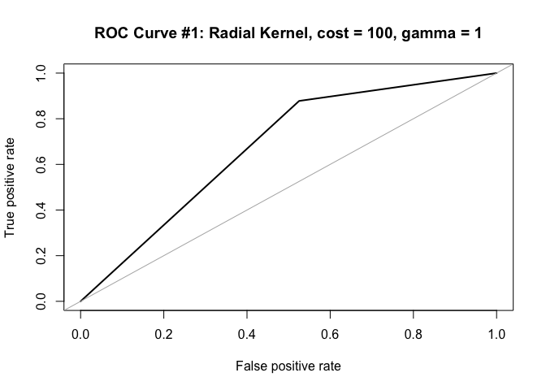
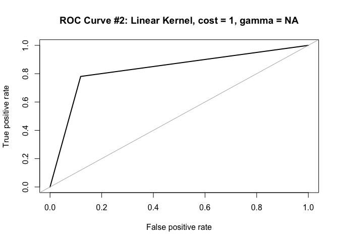
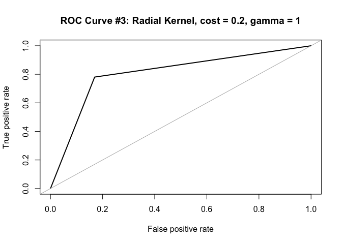
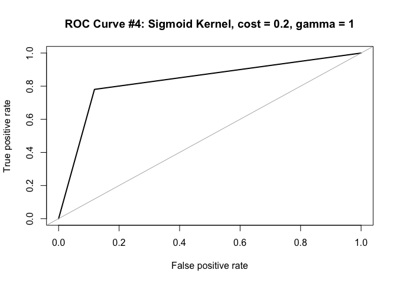
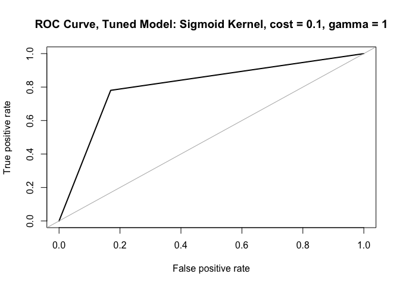

Module 4 Technique Practice
================
Justin Ehringhaus
Last edited August 06, 2022 at 12:53

-   <a href="#importing-packages" id="toc-importing-packages">Importing
    Packages</a>
-   <a href="#importing-and-exploring-the-data"
    id="toc-importing-and-exploring-the-data">Importing and Exploring the
    Data</a>
-   <a href="#preparing-the-data" id="toc-preparing-the-data">Preparing the
    Data</a>
-   <a href="#svm-model-1-radial-kernel-cost--100-gamma--1"
    id="toc-svm-model-1-radial-kernel-cost--100-gamma--1">SVM Model #1:
    Radial Kernel, cost = 100, gamma = 1</a>
-   <a href="#svm-model-2-linear-kernel-cost--1-gamma--na"
    id="toc-svm-model-2-linear-kernel-cost--1-gamma--na">SVM Model #2:
    Linear Kernel, cost = 1, gamma = NA</a>
-   <a href="#svm-model-3-radial-kernel-cost--02-gamma--1"
    id="toc-svm-model-3-radial-kernel-cost--02-gamma--1">SVM Model #3:
    Radial Kernel, cost = 0.2, gamma = 1</a>
-   <a href="#svm-model-4-sigmoid-kernel-cost--02-gamma--1"
    id="toc-svm-model-4-sigmoid-kernel-cost--02-gamma--1">SVM Model #4:
    Sigmoid Kernel, cost = 0.2, gamma = 1</a>
-   <a href="#svm-tuning" id="toc-svm-tuning">SVM Tuning</a>
-   <a href="#can-tuning-improve-the-models-accuracy"
    id="toc-can-tuning-improve-the-models-accuracy">Can tuning improve the
    model’s accuracy?</a>
-   <a href="#works-cited" id="toc-works-cited">Works Cited</a>

## Importing Packages

``` r
library(pacman)
p_load(tidyverse)
p_load(e1071)
p_load(ROSE)
```

## Importing and Exploring the Data

``` r
# Reading the data set as a dataframe
heart_df <- read_csv("/Users/justin/Desktop/ALY 6040/Homework/M4/svm-practice/heart_tidy.csv")

# Glimpse of the data
glimpse(heart_df)
```

    ## Rows: 300
    ## Columns: 14
    ## $ Age            <dbl> 63, 67, 67, 37, 41, 56, 62, 57, 63, 53, 57, 56, 56, 44,…
    ## $ V1             <dbl> 1, 1, 1, 1, 0, 1, 0, 0, 1, 1, 1, 0, 1, 1, 1, 1, 1, 1, 0…
    ## $ V2             <dbl> 1, 4, 4, 3, 2, 2, 4, 4, 4, 4, 4, 2, 3, 2, 3, 3, 2, 4, 3…
    ## $ V3             <dbl> 145, 160, 120, 130, 130, 120, 140, 120, 130, 140, 140, …
    ## $ V4             <dbl> 233, 286, 229, 250, 204, 236, 268, 354, 254, 203, 192, …
    ## $ V5             <dbl> 1, 0, 0, 0, 0, 0, 0, 0, 0, 1, 0, 0, 1, 0, 1, 0, 0, 0, 0…
    ## $ V6             <dbl> 2, 2, 2, 0, 2, 0, 2, 0, 2, 2, 0, 2, 2, 0, 0, 0, 0, 0, 0…
    ## $ V7             <dbl> 150, 108, 129, 187, 172, 178, 160, 163, 147, 155, 148, …
    ## $ V8             <dbl> 0, 1, 1, 0, 0, 0, 0, 1, 0, 1, 0, 0, 1, 0, 0, 0, 0, 0, 0…
    ## $ V9             <dbl> 2.3, 1.5, 2.6, 3.5, 1.4, 0.8, 3.6, 0.6, 1.4, 3.1, 0.4, …
    ## $ V10            <dbl> 3, 2, 2, 3, 1, 1, 3, 1, 2, 3, 2, 2, 2, 1, 1, 1, 3, 1, 1…
    ## $ V11            <dbl> 0, 3, 2, 0, 0, 0, 2, 0, 1, 0, 0, 0, 1, 0, 0, 0, 0, 0, 0…
    ## $ V12            <dbl> 6, 3, 7, 3, 3, 3, 3, 3, 7, 7, 6, 3, 6, 7, 7, 3, 7, 3, 3…
    ## $ PredictDisease <dbl> 0, 1, 1, 0, 0, 0, 1, 0, 1, 1, 0, 0, 1, 0, 0, 0, 1, 0, 0…

``` r
# Changing "predictdisease" data type to factor
heart_df[["PredictDisease"]] <- factor(heart_df[["PredictDisease"]])

# Checking for NAs
anyNA(heart_df)
```

    ## [1] FALSE

``` r
# Printing the summary
summary(heart_df)
```

    ##       Age              V1             V2              V3              V4       
    ##  Min.   :29.00   Min.   :0.00   Min.   :1.000   Min.   : 94.0   Min.   :126.0  
    ##  1st Qu.:48.00   1st Qu.:0.00   1st Qu.:3.000   1st Qu.:120.0   1st Qu.:211.0  
    ##  Median :56.00   Median :1.00   Median :3.000   Median :130.0   Median :241.5  
    ##  Mean   :54.48   Mean   :0.68   Mean   :3.153   Mean   :131.6   Mean   :246.9  
    ##  3rd Qu.:61.00   3rd Qu.:1.00   3rd Qu.:4.000   3rd Qu.:140.0   3rd Qu.:275.2  
    ##  Max.   :77.00   Max.   :1.00   Max.   :4.000   Max.   :200.0   Max.   :564.0  
    ##        V5               V6               V7              V8        
    ##  Min.   :0.0000   Min.   :0.0000   Min.   : 71.0   Min.   :0.0000  
    ##  1st Qu.:0.0000   1st Qu.:0.0000   1st Qu.:133.8   1st Qu.:0.0000  
    ##  Median :0.0000   Median :0.5000   Median :153.0   Median :0.0000  
    ##  Mean   :0.1467   Mean   :0.9867   Mean   :149.7   Mean   :0.3267  
    ##  3rd Qu.:0.0000   3rd Qu.:2.0000   3rd Qu.:166.0   3rd Qu.:1.0000  
    ##  Max.   :1.0000   Max.   :2.0000   Max.   :202.0   Max.   :1.0000  
    ##        V9            V10             V11            V12        PredictDisease
    ##  Min.   :0.00   Min.   :1.000   Min.   :0.00   Min.   :3.000   0:162         
    ##  1st Qu.:0.00   1st Qu.:1.000   1st Qu.:0.00   1st Qu.:3.000   1:138         
    ##  Median :0.80   Median :2.000   Median :0.00   Median :3.000                 
    ##  Mean   :1.05   Mean   :1.603   Mean   :0.67   Mean   :4.727                 
    ##  3rd Qu.:1.60   3rd Qu.:2.000   3rd Qu.:1.00   3rd Qu.:7.000                 
    ##  Max.   :6.20   Max.   :3.000   Max.   :3.00   Max.   :7.000

The heart dataset is comprised entirely of numeric values, and there are
no missing entries. Certain features are categorical (e.g., 0, 1, 2) and
others are continuous (e.g., 0.3, 1.2, 4.3). The values in the
PredictDisease column are either 0 or 1, suggesting this is a binary
classification problem where individuals are predicted either to have,
or to not have, a heart disease. As there are no missing values and as
the minimum and maximum values per feature appear reasonable, we will
assume there are no entry errors or outliers in this dataset. No further
cleaning of the data is necessary.

## Preparing the Data

``` r
# Splitting data into a train/test sets
index <- 1:nrow(heart_df)
set.seed(1)
testindex <- sample(index, trunc(length(index) / 3))
testset <- heart_df[testindex,]
trainset <- heart_df[-testindex,]

# Removing no longer needed variables from the environment
rm(index, testindex)

# Checking the dimensions of train/test sets
dim(trainset)
```

    ## [1] 200  14

``` r
dim(testset)
```

    ## [1] 100  14

By generating index values for each row, we can randomly sample 1/3 of
the dataset to form a test set, and take those within the other 2/3 to
form a training set. In this case, the training set holds 200 rows and
the test set holds 100 rows. Each has 14 features.

## SVM Model \#1: Radial Kernel, cost = 100, gamma = 1

``` r
set.seed(1)
svm.model <- svm(PredictDisease ~ ., 
                 data = trainset, 
                 cost = 100, 
                 gamma = 1)

# Note: 199 support vectors, which is almost all of them!
# Note: kernel not specified, defaulted to radial kernel
svm.model
```

    ## 
    ## Call:
    ## svm(formula = PredictDisease ~ ., data = trainset, cost = 100, gamma = 1)
    ## 
    ## 
    ## Parameters:
    ##    SVM-Type:  C-classification 
    ##  SVM-Kernel:  radial 
    ##        cost:  100 
    ## 
    ## Number of Support Vectors:  199

``` r
pred_train <- predict(svm.model, trainset)
mean(pred_train == trainset$PredictDisease)
```

    ## [1] 1

``` r
table(original = trainset$PredictDisease, predicted = pred_train)
```

    ##         predicted
    ## original   0   1
    ##        0 103   0
    ##        1   0  97

``` r
pred_test <- predict(svm.model, testset)
mean(pred_test == testset$PredictDisease)
```

    ## [1] 0.64

``` r
table(original = testset$PredictDisease, predicted = pred_test)
```

    ##         predicted
    ## original  0  1
    ##        0 28 31
    ##        1  5 36

``` r
# ROC curve and area under the curve
roc.curve(testset$PredictDisease, pred_test,
          main = "ROC Curve #1: Radial Kernel, cost = 100, gamma = 1")
```

<!-- -->

    ## Area under the curve (AUC): 0.676

`svm.model` uses a radial kernel and C-classification by default for
training and predicting. The kernel used should take into account the
shape of the decision boundary. For example, if the data is linearly
separable, a linear kernel is likely the most fitting. Radial kernels
(what is used here by default) are highly flexible and commonly used in
practice (Awati, n.d.).

The cost parameter controls for how support vectors are penalized when
they fall within the margin. A high cost (as cost approaches infinity)
means a high penalty and a hard margin, where every support vectors lies
exactly on the margin, and there is a risk of overfitting because the
margin fits the training data too precisely but performs poorly on new
data. A low cost (when cost approaches zero) means a low penalty and a
soft margin, where support vectors may exist between the margin and the
decision boundary, and there is a risk of underfitting because the model
may not have incorporated enough of the relevant aspects of the training
data to perform well on new data.

The gamma parameter affects the shape of the decision boundary, and the
extent to which the support vectors spread their influence. A high gamma
(as gamma approaches infinity) means the region of influence of the
support vectors becomes stronger, whereas a low gamma (as gamma
approaches zero) means the region of influence of the support vectors
becomes weaker. In other words, a high gamma may result in a tighter
decision boundary, whereas a low gamma may result in a looser decision
boundary.

Predicting train data on `svm.model` reveals an accuracy of 100%.
Overfitting is occurring because the number of support vectors equals
the number of rows in the training set, and thus the margin contains the
entirety of the dataset. The accuracy when predicting on test data is
64%, and thus the model performs less well on unseen data. The ROC Curve
graphic reveals the extent to which the model has succeeded in a
classification task. When the area under the curve (AUC) is high
(approaching 1), the model is perfectly able to separate and classify
the two classes: an ideal situation. When AUC is 0.5, a straight line,
the model is unable to distinguish between classes at all: the worst
situation. When AUC is 0, the model makes perfectly incorrect guesses,
which is funnily not too bad so long as you flip each classification!

## SVM Model \#2: Linear Kernel, cost = 1, gamma = NA

``` r
set.seed(1)
svm.model.2 <- svm(formula = PredictDisease ~.,
                   data = trainset,
                   kernel = 'linear',
                   type = 'C-classification')
svm.model.2
```

    ## 
    ## Call:
    ## svm(formula = PredictDisease ~ ., data = trainset, kernel = "linear", 
    ##     type = "C-classification")
    ## 
    ## 
    ## Parameters:
    ##    SVM-Type:  C-classification 
    ##  SVM-Kernel:  linear 
    ##        cost:  1 
    ## 
    ## Number of Support Vectors:  78

``` r
pred_train.2 <- predict(svm.model.2, trainset)
mean(pred_train.2 == trainset$PredictDisease)
```

    ## [1] 0.855

``` r
table(original = trainset$PredictDisease, predicted = pred_train.2)
```

    ##         predicted
    ## original  0  1
    ##        0 92 11
    ##        1 18 79

``` r
pred_test.2 <- predict(svm.model.2, testset)
mean(pred_test.2 == testset$PredictDisease)
```

    ## [1] 0.84

``` r
table(original = testset$PredictDisease, predicted = pred_test.2)
```

    ##         predicted
    ## original  0  1
    ##        0 52  7
    ##        1  9 32

``` r
# ROC curve and area under the curve
roc.curve(testset$PredictDisease, pred_test.2,
          main = "ROC Curve #2: Linear Kernel, cost = 1, gamma = NA")
```

<!-- -->

    ## Area under the curve (AUC): 0.831

`svm.model.2` uses a linear kernel with the cost set to the default, 1.
For linear kernels, it is unnecessary to specify gamma. Unlike
`svm.model`, which had 199 support vectors (almost the entirety of the
training set), `svm.model.2` has just 78 support vectors, which means
39% of the data influences the shape of the decision boundary.

Predicting on test data results in an accuracy of 84%, which is superior
to `svm.model`’s performance of 64%. However, cost has also been
adjusted, so it is not yet clear which kernel performs better given the
features of this particular dataset: radial or linear. The AUC in the
ROC graph is also higher than in `svm.model`, suggesting the model does
a better job at classification.

## SVM Model \#3: Radial Kernel, cost = 0.2, gamma = 1

``` r
set.seed(1)
svm.model.3 <- svm(formula = PredictDisease~.,
                   data = trainset,
                   kernel = 'radial',
                   type = 'C-classification',
                   cost = 0.2)
svm.model.3
```

    ## 
    ## Call:
    ## svm(formula = PredictDisease ~ ., data = trainset, kernel = "radial", 
    ##     type = "C-classification", cost = 0.2)
    ## 
    ## 
    ## Parameters:
    ##    SVM-Type:  C-classification 
    ##  SVM-Kernel:  radial 
    ##        cost:  0.2 
    ## 
    ## Number of Support Vectors:  147

``` r
pred_train.3 <- predict(svm.model.3, trainset)
mean(pred_train.3 == trainset$PredictDisease)
```

    ## [1] 0.885

``` r
table(original = trainset$PredictDisease, predicted = pred_train.3)
```

    ##         predicted
    ## original  0  1
    ##        0 93 10
    ##        1 13 84

``` r
pred_test.3 <- predict(svm.model.3, testset)
mean(pred_test.3 == testset$PredictDisease)
```

    ## [1] 0.81

``` r
table(original = testset$PredictDisease, predicted = pred_test.3)
```

    ##         predicted
    ## original  0  1
    ##        0 49 10
    ##        1  9 32

``` r
# ROC curve and area under the curve
roc.curve(testset$PredictDisease, pred_test.3,
          main = "ROC Curve #3: Radial Kernel, cost = 0.2, gamma = 1")
```

<!-- -->

    ## Area under the curve (AUC): 0.805

`svm.model.3` uses a radial kernel just as in `svm.model`, but the cost
has been reduced from 100 to 0.2. As discussed previously, a lower cost
results in a softer margin, where support vectors are allowed to exist
between the decision boundary and the margin. Lowering the cost resulted
in a superior model upon predicting on test data, with a training
accuracy of 88.5% and a test accuracy of 81%.

The accuracies of `svm.model.3` and `svm.model.2` are similar when
predicting on test data, but their major differences are: 1) the kernels
(radial vs. linear), and 2) the number of support vectors (147 vs. 78).
At this point, it is difficult to say which model is better, but I
presume that fewer support vectors is desirable from the standpoint of
reducing computational complexity.

## SVM Model \#4: Sigmoid Kernel, cost = 0.2, gamma = 1

``` r
set.seed(1)
svm.model.4 <- svm(formula = PredictDisease~.,
                   data = trainset,
                   kernel = 'sigmoid',
                   type = 'C-classification',
                   cost = 0.2)
svm.model.4
```

    ## 
    ## Call:
    ## svm(formula = PredictDisease ~ ., data = trainset, kernel = "sigmoid", 
    ##     type = "C-classification", cost = 0.2)
    ## 
    ## 
    ## Parameters:
    ##    SVM-Type:  C-classification 
    ##  SVM-Kernel:  sigmoid 
    ##        cost:  0.2 
    ##      coef.0:  0 
    ## 
    ## Number of Support Vectors:  112

``` r
pred_train.4 <- predict(svm.model.4, trainset)
mean(pred_train.4 == trainset$PredictDisease)
```

    ## [1] 0.845

``` r
table(original = trainset$PredictDisease, predicted = pred_train.4)
```

    ##         predicted
    ## original  0  1
    ##        0 92 11
    ##        1 20 77

``` r
pred_test.4 <- predict(svm.model.4, testset)
mean(pred_test.4 == testset$PredictDisease)
```

    ## [1] 0.84

``` r
table(original = testset$PredictDisease, predicted = pred_test.4)
```

    ##         predicted
    ## original  0  1
    ##        0 52  7
    ##        1  9 32

``` r
# ROC curve and area under the curve
roc.curve(testset$PredictDisease, pred_test.4,
          main = "ROC Curve #4: Sigmoid Kernel, cost = 0.2, gamma = 1")
```

<!-- -->

    ## Area under the curve (AUC): 0.831

`svm.model.4` uses a sigmoid kernel with the default for gamma and a low
cost of 0.2. Thus far, it produce the best accuracy upon prediction,
with a training accuracy of 84.5% and a test accuracy of 84%.

Given that both sigmoid and linear kernels produced the highest test
accuracies thus far in the comparison of different models, I will choose
one (sigmoid because it uses gamma) and attempt tuning this model with
various parameters to find optimal cost and gamma values.

## SVM Tuning

``` r
set.seed(1)
tune.svm.model.4 <- tune.svm(x = trainset[, -14], y = trainset$PredictDisease, 
                             gamma = c(10^(-2:2), 2*10^(-2:2), 3*10^(-2:2)),
                             cost = c(10^(-2:2), 2*10^(-2:2), 3*10^(-2:2)),
                             type = "C-classification", kernel = "sigmoid")
tune.svm.model.4$best.parameters$cost
```

    ## [1] 0.02

``` r
tune.svm.model.4$best.parameters$gamma
```

    ## [1] 3

Tuning an SVM model is computationally expensive, as the different
combinations of gamma and cost result in different models that are
compared to one another to select the best performing duo. In this case,
I had input 15 distinct values ranging from as low as 0.01 to as high as
100 for both cost and gamma. Tuning found that a cost of 0.02 and a
gamma of 3 is optimal for the training set.

## Can tuning improve the model’s accuracy?

``` r
set.seed(1)
tuned.svm.model <- svm(formula = PredictDisease~.,
                       data = trainset,
                       kernel = "sigmoid",
                       type = "C-classification",
                       cost = tune.svm.model.4$best.parameters$cost,
                       gamma = tune.svm.model.4$best.parameters$gamma)
tuned.svm.model
```

    ## 
    ## Call:
    ## svm(formula = PredictDisease ~ ., data = trainset, kernel = "sigmoid", 
    ##     type = "C-classification", cost = tune.svm.model.4$best.parameters$cost, 
    ##     gamma = tune.svm.model.4$best.parameters$gamma)
    ## 
    ## 
    ## Parameters:
    ##    SVM-Type:  C-classification 
    ##  SVM-Kernel:  sigmoid 
    ##        cost:  0.02 
    ##      coef.0:  0 
    ## 
    ## Number of Support Vectors:  144

``` r
pred_train.tuned <- predict(tuned.svm.model, trainset)
mean(pred_train.tuned == trainset$PredictDisease)
```

    ## [1] 0.82

``` r
table(original = trainset$PredictDisease, predicted = pred_train.tuned)
```

    ##         predicted
    ## original  0  1
    ##        0 90 13
    ##        1 23 74

``` r
pred_test.tuned <- predict(tuned.svm.model, testset)
mean(pred_test.tuned == testset$PredictDisease)
```

    ## [1] 0.81

``` r
table(original = testset$PredictDisease, predicted = pred_test.tuned)
```

    ##         predicted
    ## original  0  1
    ##        0 49 10
    ##        1  9 32

``` r
# ROC curve and area under the curve
roc.curve(testset$PredictDisease, pred_test.tuned,
          main = "ROC Curve, Tuned Model: Sigmoid Kernel, cost = 0.1, gamma = 1")
```

<!-- -->

    ## Area under the curve (AUC): 0.805

Training accuracy is now 82% and test accuracy is now 81%. To me, these
results are surprising, as `svm.model.4` comparatively had a training
accuracy of 84.5% and a test accuracy of 84%, which is better on both
fronts despite the tuned model having considered the same inputs.
Possibly, this is a result of any randomness embedded within the
creation of an SVM model, and to account for this I would propose
creating the same model iteratively in a for loop to understand the mean
accuracy and the standard deviation of accuracy. If continuing to tinker
with this model’s accuracy, I would also propose the next step be tuning
the model across different kernels to explore whether increases in
accuracy can be gained on both training and test sets simultaneously.

## Works Cited

<div id="refs" class="references csl-bib-body hanging-indent">

<div id="ref-datacamp" class="csl-entry">

Awati, Kailash. n.d. “Support Vector Machines in r.”
<https://app.datacamp.com/learn/courses/support-vector-machines-in-r>.

</div>

<div id="ref-dzone" class="csl-entry">

Kumar, Ajitesh. n.d. “SVM RBF Kernel Parameters with Code Examples.”
<https://dzone.com/articles/using-jsonb-in-postgresql-how-to-effectively-store-1>.

</div>

</div>
